<h2 data-importer="text" align="left">Hi 👋! My name is Karthikeyan Joshi and I'm currently pursuing by Bachelors In Technology.</h2>

###

<picture data-importer="pacman">
  <source media="(prefers-color-scheme: dark)" srcset="https://raw.githubusercontent.com/joshikarthikeyan4-pixel/joshikarthikeyan4-pixel/output/pacman-contribution-graph-dark.svg?game=pacman">
  <source media="(prefers-color-scheme: light)" srcset="https://raw.githubusercontent.com/joshikarthikeyan4-pixel/joshikarthikeyan4-pixel/output/pacman-contribution-graph.svg?game=pacman">
  
</picture>

###

  
  

###

  
  
  
  
  
  
  
  
  
  
  
  
  
  
  

###

  

###

 

###

  

###
